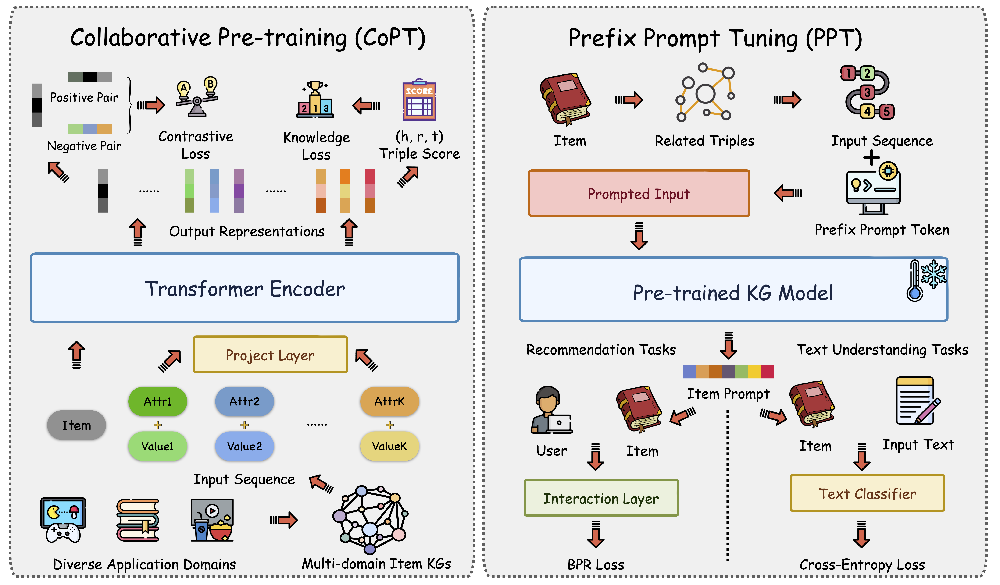

# Collaborative Pre-training on Knowledge Graphs Serves Diverse Downstream Tasks Across Domains


[](https://github.com/zjukg/NATIVE/main/LICENSE)
[](https://arxiv.org/abs/2405.13085)
[](https://pytorch.org/)
[](https://arxiv.org/abs/2405.13085)
 - [NativE: Multi-modal Knowledge Graph Completion in the Wild]()

> Knowledge graphs (KGs) provide reliable external knowledge for a wide variety of AI tasks in the form of structured triples. Knowledge graph pre-training (KGP) aims to pre-train neural networks on large-scale KGs and provide unified interfaces to enhance different downstream tasks, which is a key direction for KG management, maintenance, and applications. Existing works often focus on purely research questions in open domains, or they are not open source due to data security and privacy in real scenarios. Meanwhile, existing studies have not explored the training efficiency and transferability of KGP models in depth. To address these problems, We propose a framework MuDoK to achieve multi-domain collaborative pre-training and efficient prefix prompt tuning to serve diverse downstream tasks like recommendation and text understanding. Our design is a plug-and-play prompt learning approach that can be flexibly adapted to different downstream task backbones. In response to the lack of open-source benchmarks, we constructed a new multi-domain KGP benchmark called KPI with two large-scale KGs and six different sub-domain tasks to evaluate our method and open-sourced it for subsequent research. We evaluated our approach based on constructed KPI benchmarks using diverse backbone models in heterogeneous downstream tasks. The experimental results show that our framework brings significant performance gains, along with its generality, efficiency, and transferability.


## 👀 Overview


## 🐍 Dependencies
### Pre-training & NLP Tasks
- Python==3.9
- numpy==1.24.2
- scikit_learn==1.2.2
- torch==2.0.0
- tqdm==4.64.1
- transformers==4.28.0

### Recommendation Tasks
- python==3.10.4
- numpy==1.22.3
- torch==1.11.0
- scipy==1.7.3
- dgl==1.1.1


## 📖 Data Preparation
You should first get the textual token embedding by running `extract_amazon_emb.py` and `extract_douban_emb.py` with transformers library.
- Warning: The full datasets need a bit more time to organize and upload. We will update the full datasets soon!

## 🏃‍♀️ Train and Evaluation

### Pre-train
You can refer to the training scripts in `scripts/pretrain.sh` to reproduce our experiment results. Here is an example for DB15K dataset.

```bash
LR=3e-4
MU=0.1
TEMP=0.1
DATASET=Amazon
CUDA_VISIBLE_DEVICES=3 nohup python pretrain.py --lr $LR --mu $MU --temperature $TEMP --dataset $DATASET > log-$DATASET-LR$LR-MU$MU-TEMP$TEMP.txt &
```
The pre-trained models are saved in `save/` and can be employed by the downstream tasks.

### Downstream Tasks

#### Recommendation

You should run the following scrips:

```
cd sslrec
python main.py --model model_name
```
`model_name` can be found in the config files in `sslrec/config/modelconf`. 

#### NLP Tasks
You should run the following scrips:

```
cd downstream_nlp
python train_qa_pt.py # QA Task
python train_review_pt.py # RP Task
```
You can change the hyperparameters and tune the model easily.


## 🤝 Cite:
Please consider citing this paper if you use the code from our work.
Thanks a lot :)

```bigquery
@misc{zhang2024multidomain,
      title={Multi-domain Knowledge Graph Collaborative Pre-training and Prompt Tuning for Diverse Downstream Tasks}, 
      author={Yichi Zhang and Binbin Hu and Zhuo Chen and Lingbing Guo and Ziqi Liu and Zhiqiang Zhang and Lei Liang and Huajun Chen and Wen Zhang},
      year={2024},
      eprint={2405.13085},
      archivePrefix={arXiv},
      primaryClass={cs.CL}
}
```